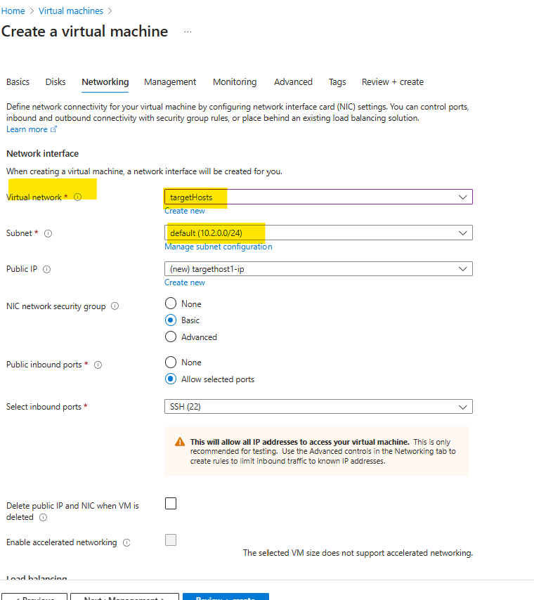

## Ansible Host setup in Azure

# What is Ansible?

`Ansible is an open-source IT automation tool that simplifies the process of configuration management, application deployment, and task automation. It uses a simple, human-readable language called YAML (Yet Another Markup Language) to define automation jobs, making it easy for both technical and non-technical users to understand and manage.`

# Key features of Ansible include:

 - Agentless: No need to install any agents on the target machines.
 - Idempotency: Ensures that repeated executions of tasks produce the same result, avoiding unintended changes.
 - Extensible: Integrates easily with various modules and plugins to extend its functionality.

How is Ansible Used?
Ansible is used to automate a wide range of IT tasks, including:

 - Configuration Management: Ensuring systems are configured consistently across environments.
 - Application Deployment: Automating the deployment of applications to multiple servers.
 - Orchestration: Coordinating multiple systems and services to work together in a specific order.
 - Provisioning: Automating the setup of new servers, virtual machines, and other infrastructure components.
 - Security and Compliance: Enforcing security policies and ensuring systems comply with regulations.

# design

# demo

create a resource group to hold meta data of the vm infrastructure  

use mremoteng to SSH to the ubuntu host ( ansible controller server)

switch to root and setup the ansible and webapp parts

`sudo apt update`

`sudo apt install ansible`

`ansible --version`

allow nsg inbound rule to access port 5000

#----------------------------

create a new vnet for target hosts

deploy a ubuntu target host and test the connectivity

ping private IP of master from target

setup peering and check the connectivity

create a user and setup a passwordless authentication by sharing the public key in authorised manner

test the password less authentication using ansible adhoc command and with ping module

have the hosts file updated with target host's private IP

# initial testing:  web <-> Ansible functionality

## Later to update the subprocess call with the ansible playbook

# testing

# docker playbook installation

# before ansible playbook execution

# execution

# result - SUCCESS

project structure

# all  resources

 

