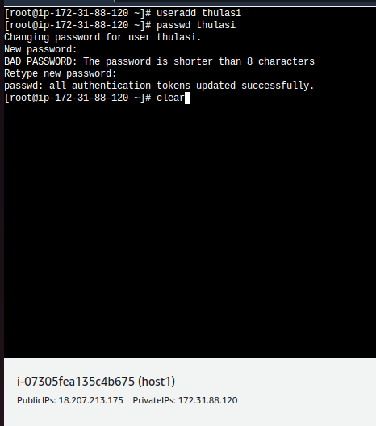

# Ansible_workbook
#

## what is `Ansible`?

Ansible is an open source automation platform

ansible automates the management of remote systems and controls their desired state.

Ansible can be used to manage different types of systems including servers like linux, windows, unix and also network devices ( routers, switches...)

Ansible uses simple and human-readable scripts called `playbooks`
to automate your tasks. you declare the desired state of a local / remote system in your playbook. Ansible ensures that the system remains in that state

Ansible is a `desired-state engine`. It approaches the problem of how to automate IT deployments by expressing them in terms of state that you want your systems to be in.

`Goal`: To put your systems into the desired state, only making the necessary changes

## FEATURES

1. Ansible is simple

Ansible playbooks are easy for humans to read, comprehend and change. 

No special coding skill is required to write ( in chef: ruby & in puppet: )

2. Ansible is powerful

you can use ansible to deploy applications for configuration management for workflow automation and for network automation

3. Ansible is agent-less ( agent based solution - chef & puppet)

Typically ansible connects to the hosts it manages using SSH ( secure shell) by pushing small programs called `Ansible Modules`

4.  Ansible is idempotent 

Task -> to create user `abc` in 50 computers. and no matter how many time you run the playbook. when the state is maintained and it will not create again.

# ANSIBLE ARCHITECTURE AND CONCEPTS

There are 2 types of machines in ansible architecture 

    -   Control node ( master )
    -   managed nodes

##### CONTROL NODE:

Ansible is installed and run from the control node
A control node can be the admin's laptop, a system shared by multiple admins or a server running `Red hat Ansible Tower` ( Enterprise version of ansible [GUI, Drag-n-Drop, RBAC, Security...] )

        Ansible     X   Ansible Tower

        Kubernetes  X   Openshift

        Opensource  x   Enterprise

        not for PROD X  PROD ✔

##### MANAGED NODES:

a.k.a `HOSTS` which are the target devices ( servers, network appliances, etc..) which you aim to manage with Ansible

Managed Nodes/Hosts are listed in an Inventory, which also organizes those systems into groups

## MODULES

Modules are basically the code / binaries that ansible copies and executes on the managed hosts to accomplish the action defined in each tasks.

## TASK

Task is the definition of an action to be applied on the manged hosts. Each task runs a module with specific arguments.

    Task : create user

    module: sudo useradd `parameter` -define steps, notify, check any existing...

## Plays and Playbooks

Instead of writing complex scripts, ansible users creates a high-level plays to ensures a hosts / a group of hosts are in a particular state.

A play performs a series of tasks on the managed hosts in the order specified by the play.

These plays are written in YAML format in a text file.

A file that contains one or more plays are called a playbook.

## HANDLERS

Handlers are a special form of task that only executes when notified by a previous task which resulted in a "changed" status

eg.. written a task to install apache webserver. another task to start apache service.

if( apache is newly installed){ then start service}

# LAB HANDS-ON

Lauch an EC2 instance ( AWS )

name: master
AMI : Redhat Linux 9
type: t2.medium ( 2vcpu, 4GiB)
KeyPair: New( RSA )
Default =>VPC
Firewall=>Network security group: all traffic ( inbound)
Storage: 30GB

Similarly

#
Create HOST1 ( managed nodes)

AMI: amazon linux
hdd: 8GB
type: t2.micro

## connect to master node to setup ansible

select master node

click connect

setup: SSH client

copy ( ssh cmd - ssh -i "kp_1903.pem" ec2-user@ec2-54-157-138-163.compute-1.amazonaws.com)

go to terminal and navigate to downloads where KP (keypair) is downloaded

# create a user in master node

sudo -i

useradd thulasi

passwd thulasi

add the user to sudoers list

vi /etc/sudoers

#allow root to run any commands anywhere
`thulasi ALL=(ALL)   NOPASSWD: ALL`

# connect to host1 and test

via EC2 cloud connect

create the same user  ( thulasi - 12345)

edit the sudoers file - to add admin ( thulasi)

# in master node

switch user - `su - sanjeeb`

`sudo dnf -y install ansible-core`

# in managed node

vi /etc/ssh/sshd_config

go to the line

/Password
PasswordAuthentication yes
systemctl restart sshd

-> to allow password less authentication, enable ssh config

and test ssh without password

# ==============================

